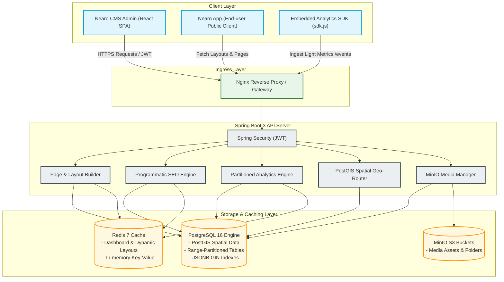
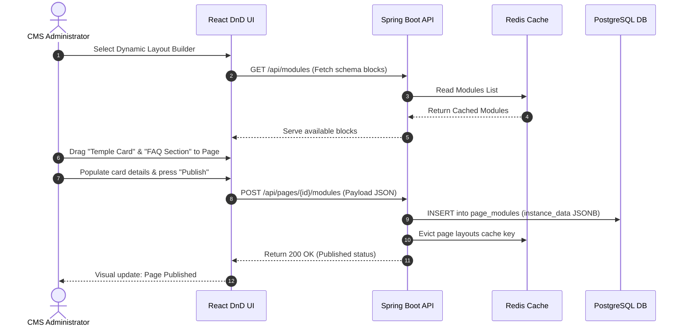
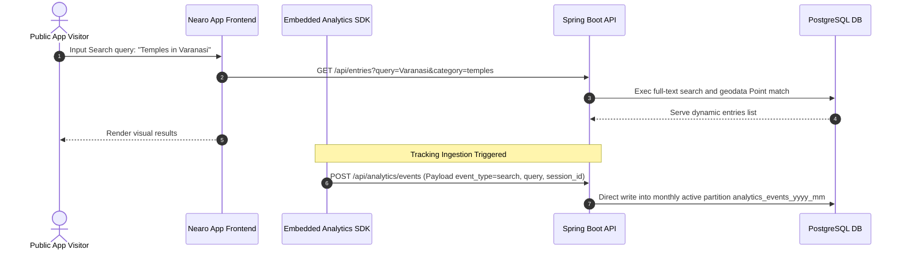
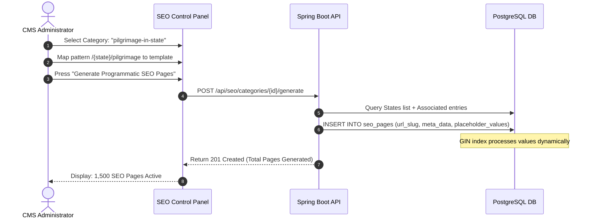
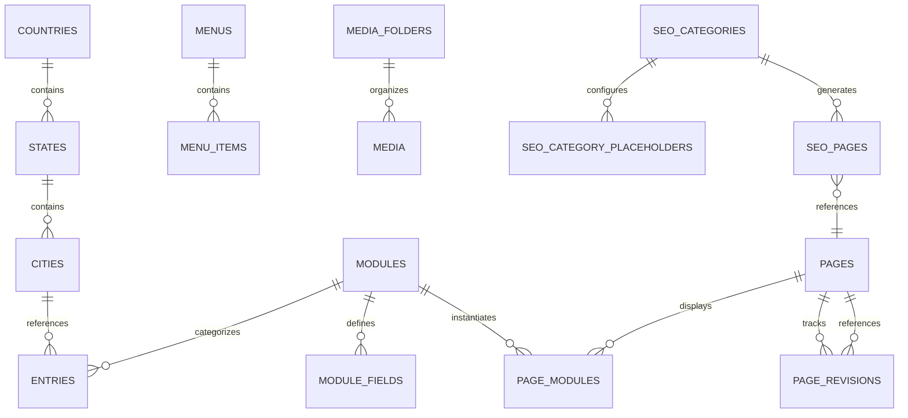
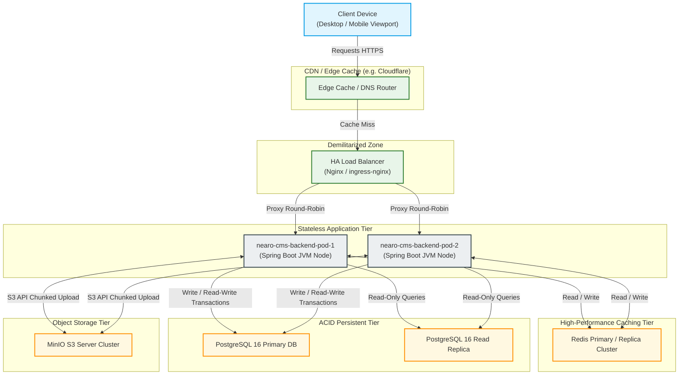

# System Architecture & Technical Specification: Nearo Platform (nearo-cms & nearo-app)

## Project Overview

### Project Name
**Nearo Platform** (Comprising `nearo-cms` and `nearo-app`)

### Description
The Nearo Platform is a highly integrated, production-grade Content Management System (CMS) and end-user discovery application designed for localized point-of-interest (POI) queries, dynamic geodata delivery, and programmatic landing page construction. Built using a robust headless architecture, the platform features a custom-built, block-based React administration panel with dynamic field mapping and a high-performance Spring Boot API gateway. It leverages an advanced database architecture built on PostgreSQL utilizing spatial indexes (PostGIS) for geographical queries, structured JSONB mapping for flexible dynamic data fields, programmatic SEO routing templates, and a horizontally partitioned event ingestion system that tracks user analytics in real-time.

```
+-----------------------------------------------------------------+
|                           NEARO APP                             |
|          Public End-User React App + Client Portal              |
|        - Dynamic layout render    - Public Search               |
|        - Localized Geolocation    - Embedded Tracking SDK       |
+-------------------------------+---------------------------------+
                                | API Requests & Metrics Ingestion
                                v
+-----------------------------------------------------------------+
|                           NEARO CMS                             |
|       - Spring Boot 3 & Spring Security Gateway API             |
|       - React-Admin Panel for Content Builders                  |
+-------------------------------+---------------------------------+
                                | JPA Data Mapping / Cache / S3
                                v
+-----------------------------------------------------------------+
|                       INFRASTRUCTURE ENGINE                     |
|  - PostgreSQL 16 (JSONB, PostGIS spatial mapping, Partitioning) |
|  - Redis 7 (Decoupled, multi-TTL in-memory cache configurations) |
|  - MinIO (Local enterprise S3 Object Storage)                   |
+-----------------------------------------------------------------+
```

### Business Problem
Modern content networks, local discovery systems, and digital directory applications are plagued by several structural business challenges:
* **Decoupled Analytics and CMS Integration:** Relying on third-party analytical solutions (e.g., Google Analytics) introduces cookie consent latency, slow dashboard syncs, data privacy compliance headaches, and substantial monthly subscription costs.
* **Rigid Data Schemas:** Building unique layout modules (e.g., Temple Info cards, Hospital details, Metro schedules) historically required database schema alterations, migration rollouts, and engineering bottlenecks.
* **Programmatic SEO Execution Gap:** Creating thousands of high-traffic local pages programmatically (e.g., "Pilgrimage sites in Mumbai" or "Metro connections near Delhi") typically demands slow client-side rendering or expensive, uncacheable dynamic database hits.
* **Spatial Discovery Lag:** Standard database searches struggle with geographical radial lookups, preventing instant sorting of nearest POIs.

### Solution Overview
The Nearo Platform provides a complete end-to-end resolution of these business problems:
1. **Dynamic Content Modules:** Business users can create dynamic modules and custom schema fields directly from the drag-and-drop Admin UI (`nearo-cms-admin`), which are stored efficiently using PostgreSQL `JSONB` fields.
2. **Built-in Range-Partitioned Analytics:** An in-house, lightweight Javascript tracking script (`/api/analytics/sdk.js`) is served from the backend, injecting telemetry (views, searches, referrers, device context) directly into a range-partitioned database log. Daily cron summary aggregations make dashboard metric updates instant.
3. **Programmatic SEO Pregeneration Engine:** Administrators declare URL patterns (e.g., `/{city}/temples`) matching placeholders to tables. The platform pregenerates static route configurations, which are instantly mapped to dynamic content modules and cached in Redis.
4. **Spatial Geolocation Database:** Leveraging PostGIS spatial extensions, coordinates are mapped to specialized spatial geometric indices (`GIST`), resolving radial point-of-interest distances in sub-millisecond execution times.

### Key Features
* **Dynamic Content Schema Mapping:** Layouts created via React DnD Kit mapped to Spring JPA backend, persisting dynamic payload attributes inside a GIN-indexed JSONB column.
* **Scale-Hardened Analytics Ingestion:** Range-partitioned database architecture dividing telemetry records into monthly Postgres tables, preventing indexing performance degradation during massive clickstream events.
* **Spatial Local Discovery:** Full PostGIS implementation supporting `GEOMETRY(Point, 4326)` columns and `ST_DWithin` calculations for instant local search.
* **Programmatic SEO Generator:** Auto-generates search-optimized pages by replacing URL variables with populated table columns (States, Cities, POIs).
* **Fully Auditable Media Library:** Hierarchical directory tree supporting file uploads to S3-compatible cloud storage (MinIO) with array-based tagging (`TEXT[]`).
* **Multi-Tiered Redis Cache Layer:** Standardized cache definitions utilizing custom TTL rules corresponding to static settings, dynamic layout builders, and dashboard metrics.

### Target Users
* **Content Creators and Managers:** Build specific landing pages using modular, dynamic templates without technical knowledge.
* **SEO Professionals:** Configure programmatic URL paths, edit site-wide meta layouts, and inject custom keywords.
* **Operations Teams:** Maintain location mapping indexes (countries, states, cities) and dynamic geographic listings.
* **Data Analysts:** Track traffic patterns, search failures, organic paths, and user agent distributions.
* **End-Users (Consumers):** Utilize `nearo-app` to discover nearby points of interest (metro systems, temples, hospitals) in rapid time.

---

## System Architecture

### Architecture Style
The Nearo Platform is built as a **Decoupled headless three-tier architecture**, prioritizing high cohesion, stateless API scaling, and high-performance relational storage.
1. **Presentation Tier:** A React Single Page Application (SPA) utilizing Vite, TypeScript, and TailwindCSS as the internal administrative panel (`nearo-cms-admin`), and `nearo-app` serving as the public-facing platform interface.
2. **Application Tier:** A stateless Spring Boot 3 REST API cluster executing Java 21 JRE, serving public endpoints to consumers and authenticated endpoints secured with custom Spring Security JSON Web Token (JWT) filters.
3. **Data & Cache Tier:** PostgreSQL 16 serving structural ACID mappings, PostGIS spatial computations, and high-volume partitioned clickstreams. Redis 7 handles distributed dynamic cache entries, while MinIO provides local, high-speed S3-compliant asset object storage.

### Component Overview
* **Admin Dashboard UI (`nearo-cms-admin`):** React 18 administrative workspace. Utilizes TailwindCSS and Shadcn UI for premium interfaces, React DnD Kit for drag-and-drop page block ordering, and Axios for stateless communication.
* **Core API Gateway (`nearo-cms-backend`):** Exposes MVC-mapped REST endpoints, acts as the media orchestrator with MinIO, dynamically generates SEO mappings, and executes automated data rollups.
* **Embedded Analytics SDK (`sdk.js`):** Lightweight, cache-friendly vanilla JavaScript bundle served publicly at `/api/analytics/sdk.js` with CORS access (`*`) and public caching (`max-age=1h`). Captures browser interactions and submits beacon-style JSON POST payloads.
* **Programmatic Routing Mapping Engine:** Matches incoming dynamic route queries from `nearo-app` against registered SEO page path hashes, serving pre-assembled dynamic modules.

### High-Level Design
Administrative CRUD requests are routed through dynamic modules, validating authentication state using an authorization filter. In parallel, read-only requests from `nearo-app` query pre-warmed Redis cache buckets, falling back to PostgreSQL if necessary. Telemetry tracking executes via non-blocking asynchronous threads to ensure write-heavy transaction logging does not lock client-facing read pipelines.

### Architecture Decisions
1. **JSONB Hybrid Schema Structure:** Rather than establishing hundreds of sparse tables for custom modules, all content parameters are stored in a unified JSONB column (`entries.data` and `page_modules.instance_data`). Search speed is guaranteed by attaching Generalized Inverted Index (GIN) structures.
2. **Monthly Range Partitioning:** Standard logging tables eventually fail due to bloated B-Tree indexes. The `analytics_events` table is partitioned by range on the `created_at` column, routing tracking records to sub-tables (e.g. `analytics_events_2026_05`).
3. **Spatial PostGIS Extensions:** Standard bounding-box longitude/latitude queries suffer from accuracy limits at high scale. Using spatial Point geometries ensures fast distance queries using mathematical distance models.
4. **Stateless JWT Security System:** Eliminates server-side session stores, enabling instant scaling of stateless backend server pods behind load balancers.

### High-Level Architecture Diagram



---

## Technology Stack

| Layer | Technology | Version | Purpose |
| :--- | :--- | :--- | :--- |
| **Frontend SPA** | React | 18.2.0 | Framework for building high-responsiveness dashboard control views. |
| **Frontend Style** | TailwindCSS + Shadcn UI | 3.x / Latest | System interface styling using harmonious colors and clean layouts. |
| **DnD Engine** | React DnD Kit | Latest | Enables smooth drag-and-drop structural building of layout blocks. |
| **Backend Core** | Spring Boot | 3.4.5 | Serves MVC mappings, filters, database interfaces, and services. |
| **Language** | Java | 21 | Utilizes modern virtual threads, pattern matching, and JRE performance benefits. |
| **Auth Context** | Spring Security | 6.x / Latest | Stateless security validation using custom JSON Web Tokens (JWT). |
| **Object Relational** | Spring Data JPA / Hibernate | Latest | Mappings for standard schemas and transactional consistency. |
| **DB Migrations** | Flyway | 10.x | Automatically tracks SQL execution and seeds foundational values. |
| **Cache Engine** | Redis | 7.x-alpine | Fast multi-TTL caching of static systems, dashboard parameters, and layouts. |
| **Database** | PostgreSQL | 16-alpine | System-of-record engine storing layouts, geodata, and metrics. |
| **Spatial Extension**| PostGIS | 16-3.4 | Adds support for spatial geometric coordinate calculations. |
| **Storage Solution** | MinIO | Latest | Serves as local, highly fast S3-compatible asset management bucket. |
| **Container Engine** | Docker & Compose | 3.9 Spec | Orchestrates uniform microservice runtimes and infrastructure services. |

---

## Functional Requirements

### Core Features
* **Modular Block Builder:** Admins drag modules (Hero Banner, Template Info, Metro stations, CTA fields) to page hierarchies. Positions are dynamic and stored in sort-order lists.
* **Schema Definition Panel:** Allows administrators to register schema types and expected value types (Text, Number, Rich Editor, Image, Boolean) dynamically without modifying underlying code.
* **Programmatic SEO Generation:** Automates creation of bulk search-optimized routes using placeholder replacement logic mapping static lists to templates.
* **Spatial Radius Locator:** Locates cities and entry points within specified coordinate radii using GPS coordinates.
* **Lightweight Clickstream Tracker:** An internal script serving page-view logging, custom query metrics, device detection, and session generation.
* **Organized Folder Storage:** Provides a nesting media tree allowing users to upload, search, tag, and organize files in designated sub-folders.

### User Flows

#### 1. Admin Page Construction Flow


#### 2. End-User Search & Tracking Flow


#### 3. SEO Page Generation Flow


### Business Rules
* **No Orphan Pages:** A page cannot be created without being linked to either a parent root node or explicitly registered as a structural dynamic SEO endpoint.
* **Strict Module Contiguity:** Dragged blocks must contain all schema values marked as `required=true` before transitioning status from `DRAFT` to `PUBLISHED`.
* **Zero PII Storage:** User IP addresses must be mathematically salted and hashed (`ip_hash`) before persisting in the analytical tables to preserve privacy.
* **Automatic Partition Rollover:** Active write transactions must map to the designated active month partition of `analytics_events`. If a partition does not exist, transactions fall back to default safety rules or fail gracefully.

---

## Non-Functional Requirements

### Scalability
* **Stateless API Clustering:** Backend Spring Boot services must not store application state, allowing elastic deployment scaling.
* **Dynamic Scale-Out Writing:** Partitioning of logs guarantees that database transactional blocks execute on focused monthly ranges, removing query overhead.
* **Database Offloading:** All heavy read paths must bypass relational queries by routing through pre-warmed Redis cache templates.

### Reliability
* **Stateless Graceful Degradation:** A total failure of the Redis cache tier must not bring down the application; the service must fall back directly to primary database reads.
* **Automatic Transaction Rollback:** Flyway database migrations must execute inside atomic transactions. Any failing migration must trigger a complete rollback of the execution batch.
* **Data Persistence Safeguards:** PostgreSQL primary-replica configurations with automated physical volume snapshots.

### Security
* **JWT Token Lifespan:** JWT authentication details are verified using a highly secure signature verification key with a configurable timeout (defaults to `86,400,000ms` / 24 hours).
* **Sanitized Media Serving:** All media assets uploaded to MinIO are passed through structured path verification filters to prevent path traversal attacks.
* **Database Constraint Sanitization:** Direct SQL operations are strictly forbidden; parameter mapping and Criteria APIs mitigate SQL injection vectors.

### Performance
* **API Ingestion Speed:** The beacon endpoint `/api/analytics/events` must return a `200 OK` response in less than 50 milliseconds by handling event processing asynchronously.
* **Spatial Query Execution:** Radial lookup times on city location geometries must return in under 15 milliseconds for up to 100,000 coordinate points using spatial GIST indexes.
* **Cache Latency:** Dynamic template page content fetched from warm Redis cache instances must execute in under 5 milliseconds.

### Availability
* **High Availability Target:** Infrastructure configuration targeting 99.9% uptime.
* **Redundant Application Nodes:** Minimum of 2 Spring Boot server nodes active across separate host containers to prevent Single Point of Failure (SPOF).
* **Robust Object Storage:** MinIO configured with multi-drive erasure coding to prevent file corruption.

---

## Application Components

### Component Architecture

```
+-----------------------------------------------------------------------------------+
|                              nearo-cms-admin (React)                              |
|   +--------------------------+  +--------------------------+  +----------------+  |
|   |   Dynamic Page Builder   |  |   Programmatic SEO panel |  | Media Manager  |  |
|   +--------------------------+  +--------------------------+  +----------------+  |
+------------------------------------------+----------------------------------------+
                                           | HTTP / JWT
                                           v
+-----------------------------------------------------------------------------------+
|                             nearo-cms-backend (API)                               |
|   +--------------------------+  +--------------------------+  +----------------+  |
|   |     Spring Security      |  |      Caching Engine      |  |  Event Ingester|  |
|   +--------------------------+  +--------------------------+  +----------------+  |
|   +--------------------------+  +--------------------------+  +----------------+  |
|   |     Spatial Geo-Router   |  |   Programmatic SEO Core  |  |  Async Engine  |  |
|   +--------------------------+  +--------------------------+  +----------------+  |
+------------------------------------------+----------------------------------------+
                                           | JDBC / TCP
                                           v
+-----------------------------------------------------------------------------------+
|                                Infrastructure                                     |
|   +------------------------------------+  +------------------+  +--------------+  |
|   |           PostgreSQL 16            |  |     Redis 7      |  |    MinIO     |  |
|   |  - PostGIS      - Partitions       |  |  - Session Cache |  |  - S3 Store  |  |
|   |  - GIN FTS      - Spatial Index    |  |  - Multi-TTL     |  |  - Media     |  |
|   +------------------------------------+  +------------------+  +--------------+  |
+-----------------------------------------------------------------------------------+
```

### Component Breakdown

#### 1. React Administrative Portal (`nearo-cms-admin`)
* **Purpose:** Provides a visual administrative portal for configuring system layouts, entering geolocation metrics, tracking site telemetry, and generating programmatic page layouts.
* **Responsibilities:** Handles React drag-and-drop actions, compiles layout configurations into structured JSON payloads, manages media file uploads via multipart forms, and visualizes analytical traffic charts.
* **Dependencies:** Node.js, React 18, TailwindCSS, Axios, ChartJS, React DnD Kit.
* **APIs Used:** Connects to all authenticated `/api/...` endpoints of `nearo-cms-backend`.

#### 2. Core API Gateway & Security Gateway
* **Purpose:** Handles the entry pipeline for the entire network, terminating CORS mappings and validating user credentials.
* **Responsibilities:** Filters incoming requests, decodes JWT headers, maps endpoint security roles, manages connection pools, and routes valid tokens.
* **Dependencies:** Spring Boot 3.4.5 Starter Security, JWT Token Decoder.
* **Key APIs:** `POST /api/auth/login`.

#### 3. Programmatic SEO Engine
* **Purpose:** Programmatically generates thousands of search-engine optimized landing pages based on defined URL patterns.
* **Responsibilities:** Compiles dynamic URLs, validates mapped placeholders against existing geographical entities, stores generated page records, and clears associated cache regions.
* **Dependencies:** Spring Boot, Jackson JSON Processor.
* **Key APIs:** `POST /api/seo/categories/{id}/generate`, `GET /api/seo/pages`.

#### 4. Range-Partitioned Analytics Ingestion Service
* **Purpose:** Captures and ingests highly verbose tracking events from client devices without introducing latency.
* **Responsibilities:** Serves `sdk.js`, parses inbound event JSON payloads, hashes client IPs, schedules async ingestion tasks, and executes daily database aggregation rollups.
* **Dependencies:** Spring Task Scheduler, Jackson, PostGIS JDBC extensions.
* **Key APIs:** `GET /api/analytics/sdk.js`, `POST /api/analytics/events`, `GET /api/analytics/overview`.

#### 5. Storage & Asset Manager
* **Purpose:** Handles physical file storage and dynamic media organization.
* **Responsibilities:** Generates secure file hashes, handles multi-part chunk uploads, routes files to local MinIO S3 buckets, generates multiple thumbnail sizes, and indexes asset tags.
* **Dependencies:** MinIO SDK, AWS S3 Client SDK, Java Image Scalr.
* **Key APIs:** `POST /api/media/upload`, `GET /api/media/folders`.

#### 6. PostGIS Spatial Geo-Router
* **Purpose:** Computes geographical routing, coordinates lookup, and POI spatial relations.
* **Responsibilities:** Maps point coordinate vectors, executes radial proximity bounding-box calculations, and matches coordinate entries.
* **Dependencies:** PostGIS Engine, Hibernate Spatial Connector.
* **Key APIs:** `GET /api/geo/countries`, `GET /api/geo/states`, `GET /api/geo/cities`.

---

## Database Design

### Databases Used
* **Primary Transactional Store:** **PostgreSQL 16** (with **PostGIS** extension enabled).
* **Caching & Session Store:** **Redis 7** (in-memory key-value cache with custom serializer configurations).

### Entity Overview



### Table Definitions & Relational Schema

```sql
-- 1. Geodata Structure
CREATE TABLE countries (
    id         BIGSERIAL PRIMARY KEY,
    name       VARCHAR(100) NOT NULL,
    code       VARCHAR(10) NOT NULL UNIQUE,
    slug       VARCHAR(120) NOT NULL UNIQUE,
    created_at TIMESTAMP NOT NULL DEFAULT NOW()
);

CREATE TABLE states (
    id          BIGSERIAL PRIMARY KEY,
    name        VARCHAR(100) NOT NULL,
    code        VARCHAR(10),
    country_id  BIGINT NOT NULL REFERENCES countries(id) ON DELETE CASCADE,
    slug        VARCHAR(120) NOT NULL,
    created_at  TIMESTAMP NOT NULL DEFAULT NOW(),
    UNIQUE(country_id, slug)
);

CREATE TABLE cities (
    id          BIGSERIAL PRIMARY KEY,
    name        VARCHAR(150) NOT NULL,
    state_id    BIGINT NOT NULL REFERENCES states(id) ON DELETE CASCADE,
    country_id  BIGINT NOT NULL REFERENCES countries(id) ON DELETE CASCADE,
    slug        VARCHAR(150) NOT NULL,
    latitude    DECIMAL(10, 7),
    longitude   DECIMAL(10, 7),
    location    GEOMETRY(Point, 4326), -- PostGIS Spatial Coordinate Point
    created_at  TIMESTAMP NOT NULL DEFAULT NOW(),
    UNIQUE(state_id, slug)
);

-- 2. Modules (Dynamic Content Schema Framework)
CREATE TABLE modules (
    id          BIGSERIAL PRIMARY KEY,
    name        VARCHAR(100) NOT NULL,
    slug        VARCHAR(120) NOT NULL UNIQUE,
    description TEXT,
    icon        VARCHAR(50),
    status      VARCHAR(20) NOT NULL DEFAULT 'DRAFT',
    created_at  TIMESTAMP NOT NULL DEFAULT NOW(),
    updated_at  TIMESTAMP DEFAULT NOW()
);

CREATE TABLE module_fields (
    id            BIGSERIAL PRIMARY KEY,
    module_id     BIGINT NOT NULL REFERENCES modules(id) ON DELETE CASCADE,
    name          VARCHAR(100) NOT NULL,
    slug          VARCHAR(120) NOT NULL,
    field_type    VARCHAR(30) NOT NULL, -- TEXT, NUMBER, RICH_TEXT, BOOLEAN, IMAGE
    required      BOOLEAN NOT NULL DEFAULT FALSE,
    position      INTEGER NOT NULL DEFAULT 0,
    default_value TEXT,
    placeholder   VARCHAR(255),
    options       JSONB,                 -- Custom select dropdown values
    created_at    TIMESTAMP NOT NULL DEFAULT NOW(),
    UNIQUE(module_id, slug)
);

-- 3. Dynamic Content Entries
CREATE TABLE entries (
    id           BIGSERIAL PRIMARY KEY,
    module_id    BIGINT NOT NULL REFERENCES modules(id) ON DELETE RESTRICT,
    slug         VARCHAR(255) NOT NULL,
    title        VARCHAR(500) NOT NULL,
    data         JSONB NOT NULL DEFAULT '{}', -- Custom dynamic attributes mapped from fields
    status       VARCHAR(20) NOT NULL DEFAULT 'DRAFT',
    published_at TIMESTAMP,
    city_id      BIGINT REFERENCES cities(id) ON DELETE SET NULL,
    state_id     BIGINT REFERENCES states(id) ON DELETE SET NULL,
    created_at   TIMESTAMP NOT NULL DEFAULT NOW(),
    UNIQUE(module_id, slug)
);

-- 4. Page Layout Structure (Nested Set Model for trees)
CREATE TABLE pages (
    id              BIGSERIAL PRIMARY KEY,
    title           VARCHAR(255) NOT NULL,
    slug            VARCHAR(255) NOT NULL,
    parent_id       BIGINT REFERENCES pages(id) ON DELETE SET NULL,
    lft             INTEGER NOT NULL DEFAULT 0,
    rgt             INTEGER NOT NULL DEFAULT 0,
    depth           INTEGER NOT NULL DEFAULT 0,
    status          VARCHAR(20) NOT NULL DEFAULT 'DRAFT',
    template_id     BIGINT,
    meta_title      VARCHAR(255),
    meta_description TEXT,
    created_at      TIMESTAMP NOT NULL DEFAULT NOW()
);

CREATE TABLE page_modules (
    id            BIGSERIAL PRIMARY KEY,
    page_id       BIGINT NOT NULL REFERENCES pages(id) ON DELETE CASCADE,
    module_id     BIGINT NOT NULL REFERENCES modules(id) ON DELETE RESTRICT,
    instance_data JSONB NOT NULL DEFAULT '{}', -- Injected layout attributes
    sort_order    INTEGER NOT NULL DEFAULT 0,
    settings      JSONB DEFAULT '{}',          -- Custom layout attributes (width, hidden, padding)
    created_at    TIMESTAMP NOT NULL DEFAULT NOW()
);

-- 5. Programmatic SEO Engine Structure
CREATE TABLE seo_categories (
    id                BIGSERIAL PRIMARY KEY,
    name              VARCHAR(150) NOT NULL,
    slug              VARCHAR(150) NOT NULL UNIQUE,
    url_pattern       VARCHAR(500) NOT NULL, -- e.g. /{city}/temples
    description       TEXT,
    meta_template     JSONB DEFAULT '{}',    -- Dynamic title/description builders
    listing_module_id BIGINT REFERENCES modules(id) ON DELETE SET NULL,
    status            VARCHAR(20) NOT NULL DEFAULT 'DRAFT',
    created_at        TIMESTAMP NOT NULL DEFAULT NOW()
);

CREATE TABLE seo_category_placeholders (
    id               BIGSERIAL PRIMARY KEY,
    seo_category_id  BIGINT NOT NULL REFERENCES seo_categories(id) ON DELETE CASCADE,
    placeholder      VARCHAR(100) NOT NULL, -- e.g. city
    entity_type      VARCHAR(30) NOT NULL,  -- CITY, STATE, COUNTRY
    entity_field     VARCHAR(50) NOT NULL,  -- slug, name
    created_at       TIMESTAMP NOT NULL DEFAULT NOW()
);

CREATE TABLE seo_pages (
    id                BIGSERIAL PRIMARY KEY,
    seo_category_id   BIGINT NOT NULL REFERENCES seo_categories(id) ON DELETE CASCADE,
    page_id           BIGINT REFERENCES pages(id) ON DELETE SET NULL,
    url_slug          VARCHAR(500) NOT NULL UNIQUE,
    meta_data         JSONB DEFAULT '{}',
    placeholder_values JSONB DEFAULT '{}',
    generated_at      TIMESTAMP,
    status            VARCHAR(20) NOT NULL DEFAULT 'ACTIVE',
    created_at        TIMESTAMP NOT NULL DEFAULT NOW()
);

-- 6. Media Structure
CREATE TABLE media_folders (
    id         BIGSERIAL PRIMARY KEY,
    name       VARCHAR(100) NOT NULL,
    parent_id  BIGINT REFERENCES media_folders(id) ON DELETE CASCADE,
    created_at TIMESTAMP NOT NULL DEFAULT NOW()
);

CREATE TABLE media (
    id               BIGSERIAL PRIMARY KEY,
    filename         VARCHAR(255) NOT NULL UNIQUE,
    original_name    VARCHAR(255) NOT NULL,
    mime_type        VARCHAR(100) NOT NULL,
    size             BIGINT NOT NULL,
    path             VARCHAR(500) NOT NULL,
    thumbnail_small  VARCHAR(500),
    thumbnail_medium VARCHAR(500),
    thumbnail_large  VARCHAR(500),
    alt_text         VARCHAR(500),
    tags             TEXT[],               -- PostgreSQL Text Array type
    folder_id        BIGINT REFERENCES media_folders(id) ON DELETE SET NULL,
    created_at       TIMESTAMP NOT NULL DEFAULT NOW()
);

-- 7. High-Volume Partitioned Analytics (Scale Hardened)
CREATE TABLE analytics_events (
    id              BIGINT GENERATED ALWAYS AS IDENTITY,
    event_type      VARCHAR(32)     NOT NULL, -- page_view, search, click
    page_url        VARCHAR(512),
    session_id      VARCHAR(64),
    city            VARCHAR(128),
    device_type     VARCHAR(16),
    referrer        VARCHAR(512),
    user_agent      TEXT,
    category        VARCHAR(64),
    search_query    VARCHAR(256),
    ip_hash         VARCHAR(64),
    created_at      TIMESTAMPTZ     NOT NULL DEFAULT NOW(),
    PRIMARY KEY (id, created_at)
) PARTITION BY RANGE (created_at);

-- Monthly Sub-Partitions Examples (Flyway Auto-Managed)
CREATE TABLE analytics_events_2026_05 PARTITION OF analytics_events
    FOR VALUES FROM ('2026-05-01') TO ('2026-06-01');
CREATE TABLE analytics_events_2026_06 PARTITION OF analytics_events
    FOR VALUES FROM ('2026-06-01') TO ('2026-07-01');
```

### Indexing Strategy
To guarantee rapid response times across all application layers, the following specialized index configuration is applied:

1. **Generalized Inverted Indexes (GIN) for Dynamic Content Search:**
   * `CREATE INDEX idx_entries_data_gin ON entries USING GIN (data);`
     * *Purpose:* Enables lightning-fast sub-key lookups inside the dynamic JSONB columns.
   * `CREATE INDEX idx_entries_title_fts ON entries USING GIN (to_tsvector('english', title));`
     * *Purpose:* Provides instant Full-Text Search on content titles.

2. **Spatial Geometry Indexes (GIST) for Radially Restricted Queries:**
   * `CREATE INDEX idx_cities_location ON cities USING GIST(location);`
     * *Purpose:* Enables fast proximity radial lookups using spatial mathematical distance methods (e.g. searching "cities nearest to coordinate X").

3. **GIN Indexes for Text Arrays & Media Tagging:**
   * `CREATE INDEX idx_media_tags ON media USING GIN (tags);`
     * *Purpose:* Instantly queries multiple text tags associated with uploaded files.
   * `CREATE INDEX idx_media_fts ON media USING GIN (to_tsvector('english', coalesce(original_name, '') || ' ' || coalesce(alt_text, '')));`
     * *Purpose:* Enables text searching of media assets using alt text or filenames.

4. **Composite Indexes for Partitioned Analytics Queries:**
   * `CREATE INDEX idx_ae_event_type ON analytics_events (event_type, created_at);`
   * `CREATE INDEX idx_ae_composite_pageview ON analytics_events (created_at, page_url) WHERE event_type = 'page_view';`
     * *Purpose:* Extremely fast daily time-series aggregation ranges and custom traffic reporting lookups.

---

## API Design

The Nearo Platform APIs are designed around standard REST principles, using distinct public and private (authenticated) routing paths. All responses are standardized using the generic wrapper schema `ApiResponse<T>`.

### Request/Response Payload Standards

#### 1. Ingest Tracking Event
* **Endpoint:** `POST /api/analytics/events`
* **Method:** `POST`
* **Authentication:** `None (Public, Wide CORS Support)`
* **Request Payload (`AnalyticsEventRequest`):**
```json
{
  "eventType": "page_view",
  "pageUrl": "/delhi/temples/lotus-temple",
  "sessionId": "sess_89f0a7d9c02b",
  "city": "Delhi",
  "deviceType": "mobile",
  "referrer": "https://www.google.com/",
  "userAgent": "Mozilla/5.0 (iPhone; CPU iPhone OS 17_4_1 like Mac OS X)...",
  "category": "temples",
  "searchQuery": null
}
```
* **Response Payload (`ApiResponse<Map<String, String>>`):**
```json
{
  "success": true,
  "message": "Operation completed successfully.",
  "data": {
    "status": "received"
  },
  "timestamp": "2026-05-31T12:45:00.123Z"
}
```

#### 2. Serve Public Analytics Script
* **Endpoint:** `/api/analytics/sdk.js`
* **Method:** `GET`
* **Authentication:** `None`
* **Behavior:** Returns `application/javascript` content type. Serves the static tracking script from JRE classpaths, establishing high-performance HTTP headers:
  * `Cache-Control: max-age=3600, public`
  * `Access-Control-Allow-Origin: *`

#### 3. Fetch Dashboard Traffic Analytics
* **Endpoint:** `/api/analytics/traffic`
* **Method:** `GET`
* **Headers:** `Authorization: Bearer <JWT_TOKEN>`
* **Request Parameters:**
  * `from` (ISO Date, e.g. `2026-05-01`, default `LocalDate.now().minusDays(30)`)
  * `to` (ISO Date, e.g. `2026-05-31`, default `LocalDate.now()`)
  * `granularity` (`daily`, `hourly`, default `daily`)
* **Response Payload (`ApiResponse<TrafficTimeSeriesResponse>`):**
```json
{
  "success": true,
  "message": "Operation completed successfully.",
  "data": {
    "granularity": "daily",
    "points": [
      {
        "date": "2026-05-30",
        "visitors": 12450,
        "pageViews": 38900,
        "sessions": 11200
      },
      {
        "date": "2026-05-31",
        "visitors": 13100,
        "pageViews": 41200,
        "sessions": 12050
      }
    ]
  },
  "timestamp": "2026-05-31T12:46:12.456Z"
}
```

#### 4. Trigger Programmatic SEO Generation
* **Endpoint:** `/api/seo/categories/{id}/generate`
* **Method:** `POST`
* **Headers:** `Authorization: Bearer <JWT_TOKEN>`
* **Response Payload (`ApiResponse<SeoGenerationSummary>`):**
```json
{
  "success": true,
  "message": "SEO pages generated successfully",
  "data": {
    "categoryId": 4,
    "categorySlug": "hospitals-near-city",
    "pagesGenerated": 482,
    "durationMs": 1420
  },
  "timestamp": "2026-05-31T12:47:30.982Z"
}
```

### Global Error Handling Wrapper
The application uses a unified `@RestControllerAdvice` wrapper (`GlobalExceptionHandler`) to translate server exceptions into clean REST error payloads:

```json
{
  "success": false,
  "message": "Access Denied: Incomplete token or signature verification failed.",
  "data": null,
  "timestamp": "2026-05-31T12:48:02.112Z"
}
```

---

## Security Design

The Nearo Platform implements a comprehensive security system designed to prevent unauthorized administrative writes while facilitating public, low-friction analytical collection.

```
       [ Public Request ]                  [ Admin Request ]
               |                                   |
               v                                   v
    +----------------------+            +----------------------+
    | Public Ingress Path  |            |   /api/admin/...     |
    | (CORS: * / No Auth)  |            |  (CORS: Dashboard)   |
    +----------+-----------+            +----------+-----------+
               |                                   |
               |                                   v
               |                        +----------------------+
               |                        | JWT Validation Filter|
               |                        |  - Signature check   |
               |                        |  - Role authority    |
               +----------------+-------+----------------------+
                                |
                                v
                    +----------------------+
                    |  Spring Controller   |
                    +----------------------+
```

### Authentication
* **Stateless JWT Tokens:** Authentication credentials are not stored in memory. The gateway decodes and verifies a stateless JSON Web Token passed in the `Authorization: Bearer <token>` header of every administrative request.
* **Cryptographic Strength:** Tokens are signed using a secure symmetric signature key (HS256) of 256 bits, custom-defined inside `.env` configurations.

### Authorization
* **Role-Based Access Control (RBAC):** Users are assigned to specific roles with tiered access:
  * `ROLE_ADMIN`: Complete system access, system configuration, geodata additions, database backups, module definitions.
  * `ROLE_EDITOR`: Page building layout creations, media uploads, entry publications, directory modifications.
  * `ROLE_ANALYST`: Read-only access to `/api/analytics/*` time-series data.

### Encryption
* **In-Transit Encryption:** High-security TLS 1.3 enforced across all web entry gates. Plaintext HTTP queries (port 80) are instantly upgraded using permanent redirects (301) to HTTPS (port 443).
* **Data-at-Rest Protection:**
  * System passwords hashed using highly secure, salted BCrypt algorithms with a work factor cost of 12.
  * Database parameters (e.g. API keys, external secrets) encrypted inside storage volumes using AES-GCM 256-bit algorithms.

### Audit Logging
All security events (e.g., failed logins, role transitions, module edits) are captured by the core logging system, outputting structural trace logs:
* **Log Structure:** `[TIMESTAMP] [SEVERITY] [USER_ID] [OPERATION] [IP_HASH] [SUCCESS_STATUS]`

### Rate Limiting
To defend public endpoints against Distributed Denial of Service (DDoS) and credential stuffing attacks, the platform enforces token-bucket rate limits at the gateway layer:
* **Authenticated Endpoints:** Restricts users to 120 API operations per minute.
* **Public Analytics Beacon Endpoint (`/api/analytics/events`):** Enforces a limit of 10 writes per second per hashed IP client, preventing database write exhaustion.

---

## Scalability Strategy

```
                                  [ Global Ingress Router ]
                                              |
                     +------------------------+------------------------+
                     |                                                 |
                     v                                                 v
           [ Spring Boot Node 1 ]                            [ Spring Boot Node 2 ]
                     |                                                 |
         +-----------+-----------+                         +-----------+-----------+
         |                       |                         |                       |
         v                       v                         v                       v
    [ Redis 7 ]         [ Postgres Primary ]          [ Redis 7 ]         [ Postgres Replica ]
(Dynamic layout cache)     (Write Target)         (Dynamic layout cache)    (Read Queries)
```

### Horizontal Scaling
* **Stateless Runtimes:** Spring Boot microservices are containerized inside stateless Docker environments, running behind an Ingress-Nginx load balancer executing a round-robin routing algorithm.
* **MinIO Storage Clustering:** Distributed object storage scales horizontally across multiple virtualized disks using local erasure coding networks, bypassing local filesystem write bottlenecks.

### Vertical Scaling
* **Monthly Database Range Partitioning:** Divides the high-frequency transaction log `analytics_events` into distinct monthly tables. This eliminates giant B-tree indexes, maintaining rapid insertion speeds by isolating indexes to the current month's active partition table.
* **Thread Pool Tuning:** The Spring Task Executor is optimized to process analytic beacons asynchronously, freeing HTTP servlet worker threads to handle primary REST requests.

### Caching Strategy
A multi-tiered Redis caching layer offloads primary database read operations. The caches are defined with specific Time-to-Live (TTL) values aligned with data volatility:

| Cache Name | TTL | Eviction Rule | Purpose |
| :--- | :--- | :--- | :--- |
| `settings` | 1 Hour | Least Recently Used (LRU) | System configs, site meta templates, layout behaviors. |
| `modules` | 15 Mins | LRU | Custom component schema blocks. |
| `seoPages` | 30 Mins | LRU | Compiled programmatic SEO page structures. |
| `analytics_overview` | 5 Mins | LRU | Cached traffic metric calculations on the admin dashboard. |
| `dashboard` | 5 Mins | LRU | Layout mapping configuration values. |

### Distributed Processing
* **Scheduled Analytics Rollups:** Rather than running heavy aggregation queries on millions of rows when an administrator opens the dashboard, a cron scheduler runs every 10 minutes, compiling delta clickstream tracking events into the `analytics_page_stats` and `analytics_daily_summary` tables.

---

## Deployment Architecture

The production environment of the Nearo Platform is built to support a highly available, containerized Docker architecture.



---

## Monitoring & Observability

### Logging
* **Unified Logger Interface:** The platform uses SLF4J backed by Logback to process framework activity.
* **Structured Format:** Log messages are written in JSON format, capturing essential attributes (`timestamp`, `log_level`, `thread`, `logger_name`, `message_payload`, `exception_stack`).
* **Storage and Retention:** Application logs are captured by container agents and routed to central log stores. High-frequency analytic partitions are maintained in the database, with older tables archived to cold storage after 90 days.

### Metrics
* **Micrometer System Integration:** The backend exposes Spring Boot Actuator endpoints metrics formatted for Prometheus at `/actuator/prometheus`.
* **Captured KPI Targets:**
  * **System Metrics:** Host CPU core load, heap memory footprint, active GC events, active HikariCP connection pool usage.
  * **HTTP Traffic:** Rate of incoming requests, response status distribution (2xx, 3xx, 4xx, 5xx), P99 latency percentiles.
  * **Database Connection Metrics:** Active database session counts, active transactional lock durations, execution times of PostGIS spatial queries.

### Alerting
* **Incident Rules:**
  * **Critical System Warnings:** CPU usage > 85% for over 5 minutes, free heap memory drop below 10%, database connection acquisition timeout rate > 2%.
  * **Application Incident Metrics:** Global error rate (5xx responses) > 1.5% of total traffic, P99 request latency exceeding 800ms.

### Tracing
* **Distributed Observability:** Implements OpenTelemetry trace instrumentation across critical call paths.
* **Correlated Telemetry:** Generates and passes a unique `trace_id` from the API gateway down to service threads and database query logs, enabling rapid debugging of isolated application bottlenecks.

---

## CI/CD Pipeline

The Nearo Platform uses an automated Continuous Integration and Continuous Delivery pipeline designed for speed, safety, and zero-downtime deployments.

```
[ Push to Main ] ---> [ Static Analysis & Lints ] ---> [ Parallel Test Suites ]
                                                               |
[ Blue-Green Deploy ] <--- [ Multi-Stage Docker Build ] <-----+
```

### Build Process
1. **Developer Push Event:** Code changes pushed to the main repository trigger the build runner.
2. **Standard Lint Checks:** Code formatting validated using standard styling engines (e.g. Spotless for Java, ESLint for React).
3. **Container Compilation:** Multi-stage Docker builds generate highly optimized, lightweight runtime images using Alpine distributions (`maven:3.9.6-eclipse-temurin-21-alpine` build environments and `eclipse-temurin:21-jre-alpine` runtime environments).

### Testing
* **Backend Pipeline:** Parallel unit tests and dynamic Spring integration tests run against ephemeral PostgreSQL and Redis Docker containers.
* **Frontend Pipeline:** Automates compilation verification, TypeScript static type assertions, and Playwright UI tests against mock API backends.

### Deployment Strategy
* **Zero-Downtime Blue-Green Deployment:** Launches new container versions alongside active production nodes inside Kubernetes namespaces.
* **Health Validation Check:** The routing gateway verifies node health using dedicated endpoints (`/actuator/health`). Once the new version passes validation checks, ingress proxies swap traffic routes.

### Rollback Strategy
* **Automated Failure Detection:** If HTTP 5xx error metrics increase by more than 5% or actuator nodes fail health checks within 10 minutes of a deployment, the ingress load balancer instantly routes traffic back to the stable rollback containers.
* **Transactional Flyway Schema Rollbacks:** Ensures database migrations run inside isolated database transactions, enabling safe rolling schema rollbacks.

---

## Performance Considerations

### Database Optimization
* **JSONB Storage Mappings:** Dynamic attributes are consolidated within GIN-indexed JSONB structures. Queries on nested JSONB variables leverage Postgres query optimization operators (e.g. `->` and `@>`), ensuring rapid indexes retrieval.
* **Composite B-Tree Indexes:** Speeds up analytical query performance by creating compound indexes on common query path combinations (e.g. `(event_type, created_at)`).

### Caching Strategy
* **Cache Eviction Routing:** When content is modified, the service evicts specific cache regions using granular evictions rather than wiping the entire cache, protecting database performance.
* **Pre-Warmed Cache Tasks:** Background schedulers pre-populate high-frequency programmatic SEO landing pages into Redis Cache during low-traffic periods.

### Connection Pooling
* **HikariCP Configuration:** The database connection pool is tuned for high concurrency and resilience:
  * `maximum-pool-size: 50` (Active threads)
  * `minimum-idle: 10` (Pre-warmed connections)
  * `connection-timeout: 30000ms` (Acquisition limit)
  * `max-lifetime: 1800000ms` (30 mins connection rotation)

### Asynchronous Processing
* **Decoupled Analytics Logs:** Inbound tracking event requests validate and return a `200 OK` response immediately, offloading event persistence to background worker threads managed by a thread pool executor.
* **Decoupled Image Resizing:** File uploads process image resizing tasks in background threads, keeping HTTP thread response paths responsive.

---

## Risks & Challenges

### Technical Risks

#### 1. Partition Table Overhead
* **Description:** Excessive partition creation (e.g., daily partitions over multiple years) can degrade database query planner performance.
* **Mitigation:** Enforces monthly range partitioning, managed by automated Flyway migration rules. Older partition tables are archived to historical databases after 12 months.

#### 2. High-Frequency Analytical Write Lockups
* **Description:** Sudden traffic spikes on client devices can overwhelm database write pipelines, locking primary tables.
* **Mitigation:** Inbound tracking payloads are buffered in-memory or written to high-performance log appenders, isolating transaction queues from primary application read paths.

#### 3. PostGIS Radius Spatial Latency
* **Description:** Radial calculation execution times can degrade as coordinate datasets grow.
* **Mitigation:** Combines spatial radial lookups with standard B-tree index constraints (e.g. pre-filtering by Country/State IDs) and utilizes GIST indexing on spatial columns.

### Business Risks

#### 1. Search Engine Crawler Rate Exceeded
* **Description:** Programmatic SEO page generation can spawn thousands of pages instantly. Unchecked search crawler indexation sweeps can spike API gateway resource usage.
* **Mitigation:** Enforces CDN edge caching on programmatic paths and configures rate limits within `robots.txt` layouts.

---

## Future Enhancements

### Short-Term Roadmap (1-6 Months)
* **Real-time Live WebSocket Analytics:** Introduces live WebSockets to stream analytical user metrics directly to the CMS dashboard panel.
* **Global Edge Deployment:** Deploys application nodes to multiple geographical regions, using geo-routing load balancers to connect users to their nearest server.
* **Integrated SEO Audit Tools:** Ingests Google Search Console performance data directly into the CMS admin panel, correlating site traffic with organic search impressions.

### Long-Term Roadmap (6-24 Months)
* **Autonomous SEO Generation:** Employs localized AI models to analyze search traffic patterns, identify content gaps, and draft programmatic landing pages.
* **Distributed Multi-Region Master Databases:** Transitions the backend from single-node PostgreSQL databases to globally distributed relational engines (e.g. CockroachDB), enabling high-performance multi-region writes.
* **Decoupled Native Mobile SDKs:** Develops lightweight, native analytical tracking modules optimized for iOS and Android devices.

---

## Conclusion

The Nearo Platform is an enterprise-grade solution that addresses key challenges in modern digital content networks and local discovery platforms. By combining NoSQL storage flexibility (JSONB) with relational ACID guarantees, spatial capabilities (PostGIS), and a partitioned analytics logging system, the platform delivers exceptional performance and scalability.

Its headless API architecture, protected by modern security protocols, enables developers to deliver fast content experiences on user devices while empowering business teams through a modular administrative interface. The platform's automated programmatic SEO pre-generation, multi-tiered Redis caching, and optimized database design provide a strong technical foundation to support rapid organizational growth.
